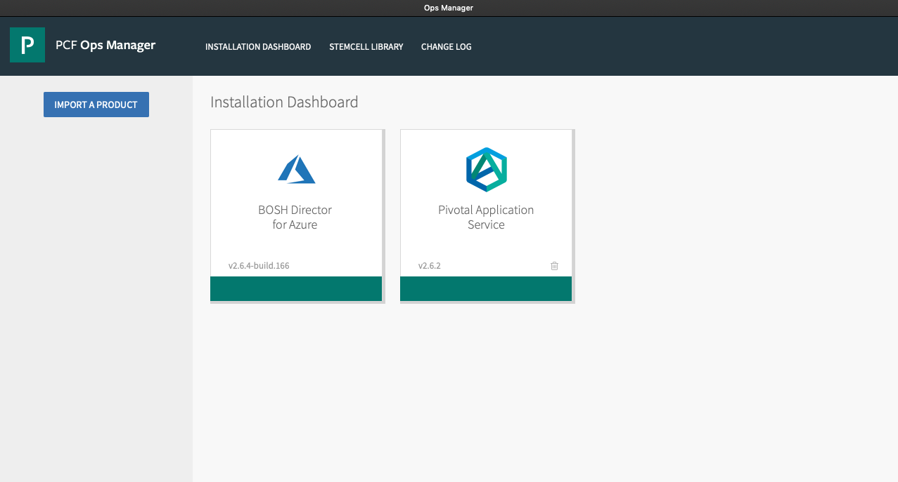
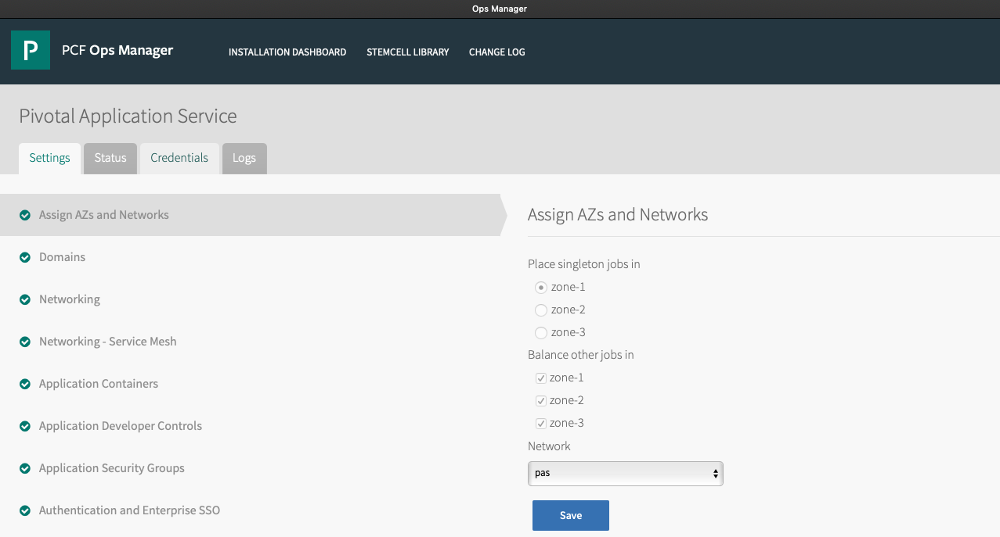
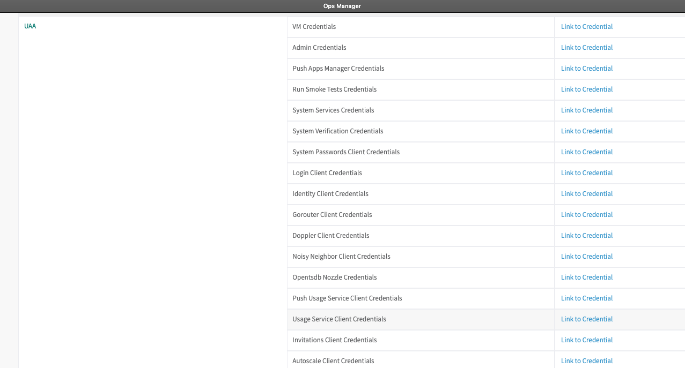
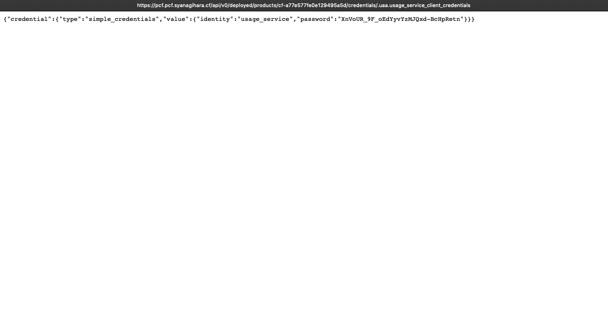

# Pivotal Telemetry Collector

Pivotal Telemetry Collector is an automated tool that collects data from a series of Pivotal Cloud Foundry (PCF) APIs found within a foundation and securely sends that data to Pivotal. The tool collects:

- Configuration data from the Ops Manager API.
- Optional certificate data from the CredHub API.
- Optional app, task and service instance usage data from the Usage Service API.

[Document](https://docs.pivotal.io/telemetry/1-0/index.html)

## Description

## Demo

## Features

- feature:1
- feature:2

## Requirement

## Usage

### Install

- Download Pivotal Telemetry Collector CLI binary
  - https://network.pivotal.io/products/pivotal-telemetry-collector/
- Add the binary to `$PATH`
  - `$ cp telemetry-collector-darwin-amd64 /usr/local/bin/telemetry-collector`

### Use Pivotal Telemetry Collector CLI

```
telemetry-collector collect \
  --url OPSMAN_URL \
  --username OPSMAN_USERID \
  --password OPSMAN_PASSWD \
  --env-type FOUNDATION_TYPE \
  --cf-api-url API_URL \
  --usage-service-url APP_USAGE_URL \
  --usage-service-client-id usage_service \
  --usage-service-client-secret APP_USAGE_SECRET \
  --output-dir OUTPUT_DIRECTORY \
  --insecure-skip-tls-verify \
  --usage-service-insecure-skip-tls-verify
```

|OPTION-FLAG|DESCRIPTION|
|-----------|-----------|
|url||
|username||
|password||
|env-type||
|cf-api-url||
|usage-service-url||
|usage-service-client-id||
|usage-service-client-secret||
|usage-service-insecure-skip-tls-verify||

```
telemetry-collector collect \
  --url https://pcf.pivotal.syanagihara.cf \
  --username admin \
  --password admin \
  --env-type development \
  --cf-api-url https://api.sys.pivotal.syanagihara.cf \
  --usage-service-url https://app-usage.sys.pivotal.syanagihara.cf \
  --usage-service-client-id usage_service \
  --usage-service-client-secret XnVoUR_9F_oEdYyvYzMJQxd-BcHpRetn \
  --output-dir output \
  --insecure-skip-tls-verify \
  --usage-service-insecure-skip-tls-verify
```

### Usage Service Client Secret






## Installation

## Licence

Released under the [MIT license](https://gist.githubusercontent.com/shinyay/56e54ee4c0e22db8211e05e70a63247e/raw/34c6fdd50d54aa8e23560c296424aeb61599aa71/LICENSE)

## Author

[shinyay](https://github.com/shinyay)
